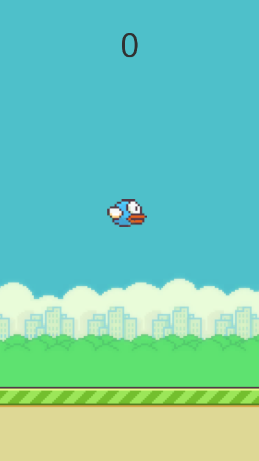

# ❌⭕️ Flappy-Bird-2D

> A simple, fun, and challenging game built with Unity, designed to showcase clean architecture, gameplay mechanics, and professional coding practices. This game is part of my open-source portfolio to demonstrate my Unity development skills.

---

## 🎮 Gameplay Overview

**Game Type:** Endless Runner  
**Genre:** Casual  
**Platform:** Android  
**Engine:** Unity 2022.3.58f

### 🔑 Key Features
- 🐦 Simple one-tap controls (flap to fly)
- 🎨 2D pixel-art style graphics 
- 🧩 Clean and modular game structure

---

## 📷 Screenshots

| Gameplay | GameOver |  |
|---------|------------------|--------|
|  | |
---

## 🔧 Technologies Used

| Tool / Library | Description |
|----------------|-------------|
| **Unity Engine** | Game development platform |
| **C#** | Core scripting and logic |
| **Unity Input System** | Input handling (keyboard, touch) |
| **Unity Physics** | Rigidbody2D for movement |
| **Unity UI Toolkit** | UI elements and transitions |

---

## 📁 Project Structure (High-Level)

```
📂 Assets/
  ├─ 📁 Animation/
  ├─ 📁 Scripts/
  │   ├─ Bird.cs
  │   ├─ PipeMove.cs
  │   ├─ PipeSpawner.cs
  ├─ 📁 Prefabs/
  ├─ 📁 Scenes/
  ├─ 📁 Sprites/
```

---

## 🚀 How to Run the Game

### Requirements
- Unity 2022.3.58f or newer
- Git (optional)

### Setup Instructions
```bash
git clone https://github.com/MsaidGames/Flappy-Bird-2D.git
```

1. Open Unity Hub and click **Add Project** → Select the folder.
2. Open the project in Unity.
3. Press **Play** in the Editor to run.
4. To build:
   - Go to `File > Build Settings`
   - Choose platform (PC/WebGL/Android)
   - Click **Build**

---

## 🧑‍💻 Contributions

🎉 Contributions are welcome!  
Feel free to fork the repo and submit pull requests.

- Report bugs via [Issues](https://github.com/MsaidGames/Flappy-Bird-2D/issues)
- Suggest new features or improvements

---

## 📜 License

This project is licensed under the [MIT License](LICENSE).

---